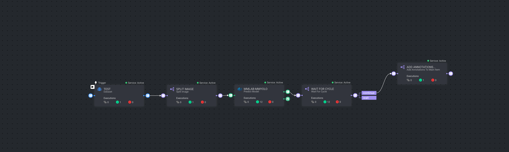

# Smart tiling pipeline nodes

This repo includes 2 pipeline nodes app and 1 pipeline template.

## Installation

To install the Dataloop Image Tiling Service from the Dataloop Marketplace, follow these steps:

1. **Sign in to Dataloop:**
   Go to the Dataloop platform and sign in with your credentials.

2. **Navigate to the Marketplace:**
   In the Dataloop dashboard, navigate to the Marketplace section.

3. **Find the App:**
   Search for the app, based on displayName in datallop.json in the Marketplace.

4. **Install the App:**
   Click on the App and follow the on-screen instructions to install it to your Dataloop environment.

## Pipeline Nodes

- **Image Tiling Split**

  The installation will create the following pipeline nodes:

  1.  **Split Image:**

      - **Description:** Split image to tiles based on tile size and minimal overlap
      - **Configuration:**
      - `tile_size`: The size of each tile in pixels.
      - `min_overlapping`: The minimum overlap between adjacent tiles in pixels.

  2.  **Wait For Cycle:**

      - **Description:** Wait until all previous executions are done

  3.  **Add Annotations To Parent Item:**

      - **Description:** Add all bounding box annotations to the main item
      -

- **Image Tiling Mask Split**

  The installation will create the following pipeline nodes:

  1.  **Split Image With Mask:**

      - **Description:** Split image to tiles based on tile size and add mask to each tile
      - **Configuration:**
      - `tile_height`: the height of each tile
      - `tile_width`: the width of each tile

  2.  **Add Segmentation Annotations To Parent Item:**

      - **Description:** This function will add all segmentation annotations to the parent item

## Pipeline Template

- **Smart Tiling**

  - template for **Image Tiling Split**, to simplify the smart tiling pipeline creation
    
